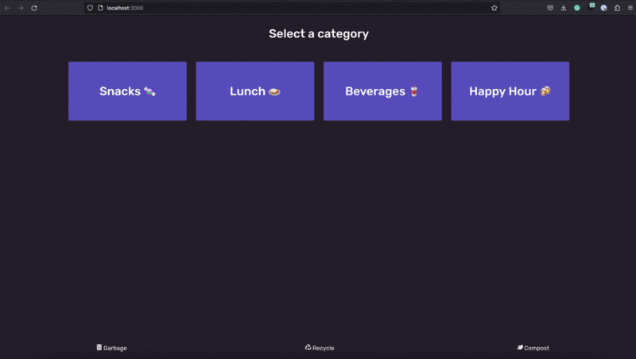

# Trash Panger

This Hackweek project is a waste categorization and management tool built using React. It provides a user interface for categorizing different types of waste (garbage, recycling, compost) and managing the selections made.

## To run app
In the project directory, you can run:

### `npm start`

Runs the app in the development mode.\
Open [http://localhost:3000](http://localhost:3000) to view it in your browser.

The page will reload when you make changes.\

Currently deployed on an Ipad interface in our office.

# Problem Statement

The app was aimed at helping my colleagues categorize different types of waste and managing those categorizations. It provides a user-friendly interface with buttons, icons, and the ability to edit the underlying data. The data is stored in JSON format and can be saved, reset, and edited using the provided components and interactions.

# Example of WebApp WorkFlow:

## 🔗 Links

